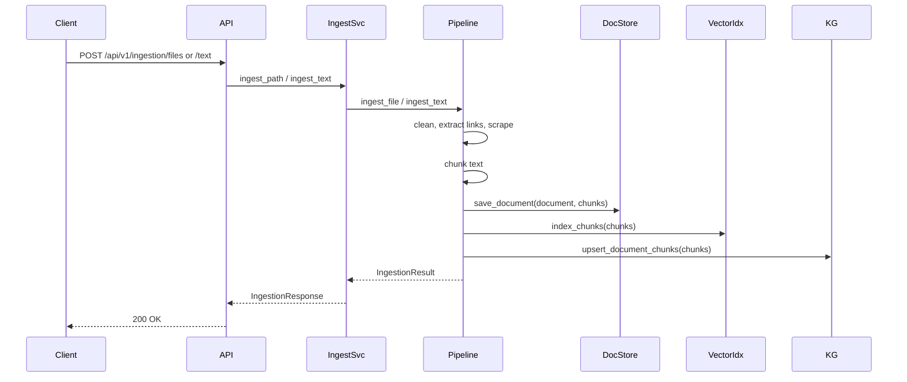
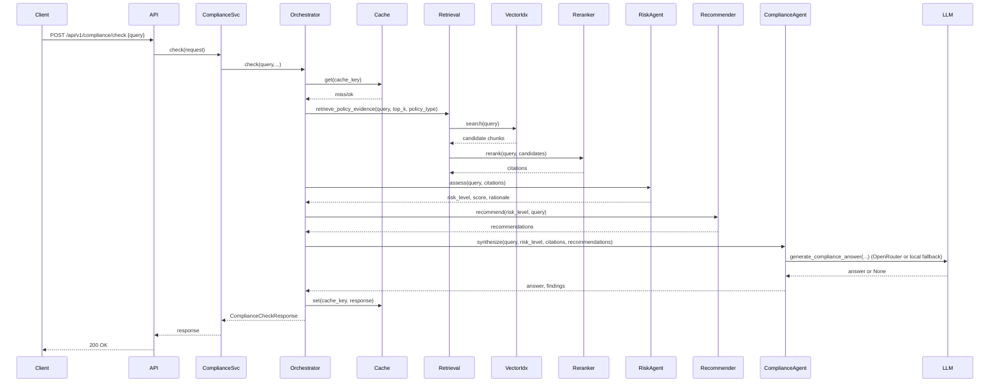

# I/O Flow

This document describes the two primary I/O flows in the system: (A) Document ingestion and indexing, and (B) Compliance check / query flow. It references data models used inside the backend.

## Key data models

- `PolicyDocument` — id, title, source, policy_type, text, metadata, created_at
- `DocumentChunk` — id, document_id, title, text, chunk_index, policy_type, source, metadata
- `Citation` — document_id, chunk_id, title, source, excerpt, score

Files: see `backend/app/models/domain_models.py` for exact fields.

## A. Ingestion & Indexing Flow

1. Client uploads: POST `/api/v1/ingestion/text` or `/api/v1/ingestion/files` (multipart/form-data).
2. `IngestionService` (`backend/app/services/ingestion_service.py`) receives request and calls ingestion pipeline.
3. Pipeline (`backend/app/ingestion/pipeline.py`):
   - Load file text (file loaders) or use provided text.
   - Clean and normalize text (`cleaner.py`).
   - Optionally extract links from text and scrape linked pages via `ScrapingAgent` (httpx) and append as "Linked Evidence".
   - Build overlapping chunks (`chunker.build_chunks`) using configured `CHUNK_SIZE` and `CHUNK_OVERLAP`.
   - Persist document and chunks to the document store adapter (local JSON or MongoDB) via `database/mongodb.py` (store.save_document).
   - Index chunks into the vector store adapter (local deterministic embeddings or Weaviate) via `database/weaviate.py` (vector_index.index_chunks).
   - Upsert relationships to knowledge graph adapter (local in-memory or Neo4j) via `database/neo4j.py` (knowledge_graph.upsert_document_chunks).
4. Response: `IngestionResult` with created document id, title, chunks_created, policy_type.

Mermaid sequence (ingest):

## B. Compliance Check / Query Flow

1. Client calls POST `/api/v1/compliance/check` with `query`, optional `policy_type`, `top_k` and `include_recommendations`.
2. `ComplianceService` delegates to `ComplianceOrchestrator` which attempts a cached response via the cache adapter (`database/redis.py`). Cache can be local in-memory or Upstash REST Redis.
3. Orchestrator applies guardrails (`security.guardrails.screen_user_text`) and stops if blocked.
4. Orchestrator invokes retrieval via `RetrievalAgent` which calls `retrieval.hybrid_search`:
   - `hybrid_search` calls `vector_search` (vector store adapter search or local cosine search), collects candidate chunks, and uses `reranker.rerank` (lexical overlap) to produce top citations.
5. Orchestrator invokes `RiskAgent.assess` to compute a numeric score and `RiskLevel` using local keyword taxonomies and thresholds from config.
6. If recommendations are requested, `RecommendationAgent.recommend` generates next-step actions based on `RiskLevel`.
7. `ComplianceAgent` synthesizes an answer by calling the LLM client (`services/llm_service.py`):
   - LLM provider is OpenRouter (if configured), otherwise the local fallback returns `None` and a deterministic/local answer is used.
8. The orchestrator assembles `ComplianceCheckResponse`: query, answer, risk_level, findings list, citations list, recommendations.
9. Result is cached (if cache writable) and returned to client.

Mermaid sequence (compliance check):

## I/O Formats

- HTTP JSON request/response for endpoints:
  - `POST /api/v1/ingestion/text` — JSON body with title, text, source, policy_type, metadata.
  - `POST /api/v1/ingestion/files` — multipart form files + optional `policy_type`.
  - `POST /api/v1/compliance/check` — JSON body: `{query, top_k, policy_type, include_recommendations}`.
  - `POST /api/v1/compliance/search` — JSON body: `{query, top_k, policy_type}` returns `SearchResponse` with `Citation` items.

Refer to the Pydantic request/response models in `backend/app/models` for exact JSON shapes.
